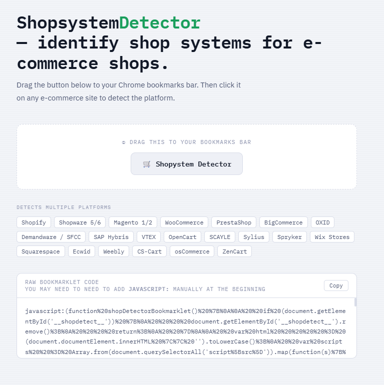

# 🛒 Shopsystem Detector

A zero-dependency browser bookmarklet that tries to identify the shop system behind an online shop.

> **⚠️ Disclaimer:** Detection is based on heuristics (DOM inspection, script sources, cookies, global variables). Results may be inaccurate or incomplete, especially on heavily customised, headless, or PWA-based storefronts. Use as a starting point, not as definitive answer.

---

## How it works

Click the bookmarklet on any shop page and a small overlay appears in the bottom-right corner showing:

- The most likely platform with a confidence score
- Secondary matches if multiple signals are found

Everything runs locally in the browser. No network requests are made, no data is sent anywhere.

Detection works by passively inspecting:

- **Global window variables** — e.g. `window.Shopify`, `window.wc_cart_params`
- **Script and link `src` attributes** — CDN URLs and path patterns
- **HTML source** — class names, data attributes, meta tags
- **Cookies** — session and tracking cookie names

Each platform has a weighted set of checks. The one with the highest ratio of matched signals is shown first.

---

## Installation

1. Open `shopsystem-detector.html` in your browser
2. Drag the **🛒 Shopsystem Detector** button to your bookmarks bar
3. Done — click it on any shop to run detection

**Can't drag?** Copy the raw bookmarklet code shown on the page, create a new bookmark manually, and paste the code as the URL. Make sure it starts with `javascript:`.

> **Chrome:** Enable the bookmarks bar with `Ctrl+Shift+B`

---

## License

This project is open-source under the MIT License. Feel free to use and modify.